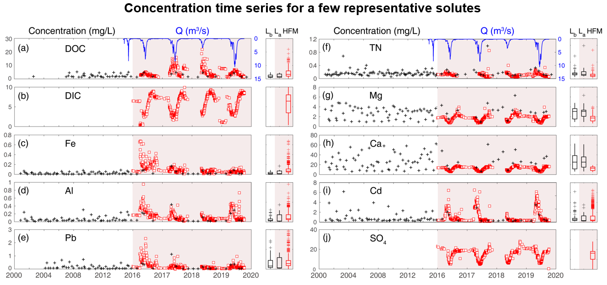

# Significant stream chemistry response to temperature variations in a high-elevation mountain watershed
https://www.nature.com/articles/s43247-020-00039-w

**Abstract**: High-elevation mountain regions, central to global freshwater supply, are experiencing more rapid warming than low-elevation locations. High-elevation streams are therefore potentially critical indicators for earth system and water chemistry response to warming. Here we present concerted hydroclimatic and biogeochemical data from Coal Creek, Colorado in the central Rocky Mountains at elevations of 2700 to 3700 m, where air temperatures have increased by about 2 °C since 1980. We analyzed water chemistry every other day from 2016 to 2019. Water chemistry data indicate distinct responses of different solutes to inter-annual hydroclimatic variations. Specifically, the concentrations of solutes from rock weathering are stable inter-annually. Solutes that are active in soils, including dissolved organic carbon, vary dramatically, with double to triple peak concentrations occurring during snowmelt and in warm years. We advocate for consistent and persistent monitoring of high elevation streams to record early glimpse of earth surface response to warming.

**Data availability**: The daily discharge data (site ID 09111250) and long-term stream chemistry (site ID 385224106590100) is available from the USGS website (https://waterdata.usgs.gov/co/nwis/). The high-frequency stream chemistry data is available at data portal for East River watershed in Colorado, managed by Lawrence Berkeley National Laboratory (https://watershed.lbl.gov/). 

**Machine learning extrapolation**: To infer the missing USGS dicharge records in 2000 - 2006, we used the machine learning statistical approach Gaussian Process Regression (GPR). We trained a discharge model (Matlab R2018a, Machine Learning Regression Toolbox, 5-fold cross-validation) using the odd years of climate and discharge data from 2006 – 2019, and tested the model using even year data. Specifically, the model uses time series of precipitation, radiation, temperature, pressure, wind speed, SNOTEL data, and discharge data as inputs for training, and output missing discharge data in 2000 – 2006. The Nash–Sutcliffe Efficiency (NSE) values for the training and testing were 0.9 and 0.7, respectively, both are higher than the NSE satisfactory criteria of 0.5 and therefore are satisfactory. ***The model code and input data are deposited in the supporting data folder.***

**Reference**: Zhi, W., Williams, K.H., Carroll, R.W.H. et al. Significant stream chemistry response to temperature variations in a high-elevation mountain watershed. Commun Earth Environ 1, 43 (2020). https://doi.org/10.1038/s43247-020-00039-w
